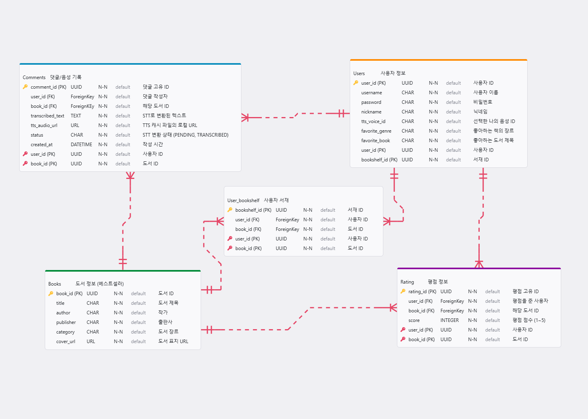

# 북북 (BOOKBOOK)

> AI 기반 북토킹 커뮤니티 앱

북북은 낯선 사람과의 음성 커뮤니케이션 부담을 낮추는 북토킹 커뮤니티 앱입니다. 주요 기능으로 선호 도서와 카테고리를 통한 도서 추천과 도서별 AI 요약본 제공 및 커뮤니티 서비스가 있습니다. 

## 📌 주요 기능

### 1. 사용자 인증
- 로그인 / 회원가입
- 유저 프로필 관리 (닉네임, 한줄소개, 취향 도서, 카테고리, TTS 목소리)
- 로그아웃 및 회원 탈퇴 (토스트 메시지 제공)

### 2. 도서 목록 제공
- **베스트셀러**: 기간별 베스트셀러 목록 제공

### 3. AI 맞춤 도서 제공
- 선호 도서와 카테고리로 사용자 맞춤 도서 제공

### 4. 도서별 상세 페이지
- **AI 도슨트 가이드**: 도서별 내용 요약본을 TTS를 통해 제공
- **TOKTOK 작성**: 텍스트와 음성(STT 기능)을 통해 댓글 작성 가능, 수정 및 삭제 기능 제공
- **도서별 벌점 계산**: 댓글별 별점 제공을 계산하여 도서별 평균 별점 계산하여 표현

### 5. 검색 기능
- 제목 또는 작가로 도서 검색 가능

### 6. 마이페이지
- **도서 책장 기능**: 사용자가 댓글을 단 도서들을 모아서 보여줌
- **읽은 책 갯수 표현**: 댓글을 단 도서 개수를 표현
- **작성한 댓글 수 표현**: 총 몇개의 댓글을 달았는지 표현
- **평균 평점 계산**: 작성한 전체 댓글의 평점을 계산

### 7. PWA 적용
- pwa 기술을 적용하여 웹을 앱처럼 사용할 수 있도록 함
- 설치 아이콘을 클릭하면 모바일 혹은 PC화면에 BOOKBOOK 로고와 함께 아이콘이 등장하여 실제 앱처럼 사용 가능함

## 🛠 기술 스택

### Frontend
- **Framework**: Vue.js 3
- **Build Tool**: Vite
- **Routing**: Vue Router 4
- **Styling**: Scoped CSS, Flexbox, Grid
- **Language**: JavaScript (ES6+)

### Backend
- **Framework**: Django REST Framework (DRF)
- **Language**: Python 3.10+
- **Authentication**: Token Authentication
- **Database**: SQLite
- **APIs**: Whisper-1, gpt-4o-mini-tts, text embedding 3 small


## 🧭 ERD




## 📂 프로젝트 구조

### Frontend


```
FRONTEND
├─ bookbook
│  ├─ dev-dist
│  │  ├─ registerSW.js
│  │  ├─ sw.js
│  │  └─ workbox-5a5d9309.js
│  ├─ index.html
│  ├─ jsconfig.json
│  ├─ package-lock.json
│  ├─ package.json
│  ├─ postcss.config.js
│  ├─ public
│  │  ├─ favicon.ico
│  │  ├─ pwa-192x192.png
│  │  └─ pwa-512x512.png
│  ├─ README.md
│  ├─ src
│  │  ├─ App.vue
│  │  ├─ assets
│  │  │  └─ ex_img.jpeg
│  │  ├─ components
│  │  │  ├─ AddCommentDialog.vue
│  │  │  ├─ BookCard.vue
│  │  │  ├─ BookDetailPage.vue
│  │  │  ├─ BottomNavigation.vue
│  │  │  ├─ HomePage.vue
│  │  │  ├─ LibraryPage.vue
│  │  │  ├─ LoadingOverlay.vue
│  │  │  ├─ LoginPage.vue
│  │  │  ├─ MyPage.vue
│  │  │  ├─ OnboardingPage.vue
│  │  │  ├─ ProfilePage.vue
│  │  │  ├─ SearchDialog.vue
│  │  │  ├─ SignupPage.vue
│  │  │  ├─ StarRating.vue
│  │  │  ├─ ToastMessage.vue
│  │  │  └─ VoiceComment.vue
│  │  ├─ main.js
│  │  ├─ store
│  │  │  └─ index.js
│  │  └─ style.css
│  ├─ tailwind.config.js
│  └─ vite.config.js
├─ package-lock.json
└─ package.json

```

### Backend


```
BACKEND
├─ bookbook_backend
│  ├─ asgi.py
│  ├─ settings.py
│  ├─ urls.py
│  ├─ wsgi.py
│  └─ __init__.py
├─ books
│  ├─ admin.py
│  ├─ apps.py
│  ├─ fixtures
│  │  ├─ books.json
│  │  └─ categories.json
│  ├─ management
│  │  ├─ commands
│  │  │  ├─ generate_embeddings.py
│  │  │  ├─ get_bestsellers.py
│  │  │  └─ __init__.py
│  │  └─ __init__.py
│  ├─ migrations
│  │  ├─ 0001_initial.py
│  │  ├─ 0002_book_embedding_vector_alter_book_author_and_more.py
│  │  ├─ 0003_book_is_bestseller.py
│  │  ├─ 0004_comment.py
│  │  ├─ 0005_alter_comment_options.py
│  │  ├─ 0006_comment_voice_choice.py
│  │  └─ __init__.py
│  ├─ models.py
│  ├─ serializers.py
│  ├─ tests.py
│  ├─ urls.py
│  ├─ utils.py
│  ├─ views.py
│  └─ __init__.py
├─ manage.py
├─ requirements.txt
└─ user
   ├─ admin.py
   ├─ apps.py
   ├─ migrations
   │  ├─ 0001_initial.py
   │  ├─ 0002_alter_customuser_managers_remove_customuser_username.py
   │  ├─ 0003_customuser_bio.py
   │  └─ __init__.py
   ├─ models.py
   ├─ serializers.py
   ├─ tests.py
   ├─ urls.py
   ├─ views.py
   └─ __init__.py

```


## 🚀 주요 API 엔드포인트

### 🔐 인증 및 사용자 (Authentication & User)
* **POST** `/api/v1/user/signup/` : 회원가입 (취향 정보 포함)
* **POST** `/api/v1/user/login/` : 로그인 및 토큰 발급
* **GET** `/api/v1/user/me/` : 내 정보 및 독서 통계 조회
* **PATCH** `/api/v1/user/profile/update/` : 프로필 수정 (닉네임, 목소리 등)
* **GET** `/api/v1/user/library/` : 내 서재 목록 조회
* **DELETE** `/api/v1/user/delete/` : 회원 탈퇴

### 📚 도서 및 추천 (Books & Recommendation)
* **GET** `/api/books/` : 전체 도서 목록 (최신순)
* **GET** `/api/books/<int:pk>/` : 도서 상세 정보 조회
* **GET** `/api/books/bestsellers/` : AI 선정 베스트셀러 목록
* **GET** `/api/books/main-recommendations/` : 메인 페이지 개인 맞춤형 추천
* **GET** `/api/books/recommendations/<int:pk>/` : 특정 도서 연관 도서 추천

### 💬 댓글 및 별점 (TOKTOK & Rating)
* **POST** `/api/books/<int:book_pk>/comments/` : TOKTOK(댓글) 및 평점 작성
* **PATCH** `/api/books/<int:book_pk>/comments/<int:pk>/` : 내 TOKTOK 수정
* **DELETE** `/api/books/<int:book_pk>/comments/<int:pk>/` : 내 TOKTOK 삭제

### 🤖 AI 서비스 (AI Audio Services)
* **POST** `/api/books/tts/` : 텍스트 음성 변환 (OpenAI TTS)
* **POST** `/api/books/transcribe/` : 음성 텍스트 변환 (Whisper STT)
* **POST** `/api/books/<int:pk>/docent/` : 도서 요약 AI 도슨트 오디오 생성

## 💡 사용 방법

### 1. 로그인
- 처음 사용할 경우 온보딩 페이지 등장
- 회원가입 후 로그인

### 2. 메인 화면
- 이번주 베스트셀러 및 회원가입 시 작성한 취향을 통해 AI 맞춤 도서 제공

### 3. 도서별 상세 페이지
- 도서별로 AI 내용 요약본 기능을 통해 북토킹을 활발하게 할 수 있는 환경 제공
- 도서별로 TOKTOK 작성 가능 및 여러 사람들과 TTS기능을 통해 자신의 이야기를 나눌 수 있음

### 4. 마이페이지
1. 읽은 책을 모아볼 수 있음
2. 선호 도서와 카테고리를 수정할 수 있음
3. 표현하고자 하는 tts 목소리를 변경할 수 있음

## 📄 라이선스

이 프로젝트는 교육 목적으로 제작되었습니다.

---